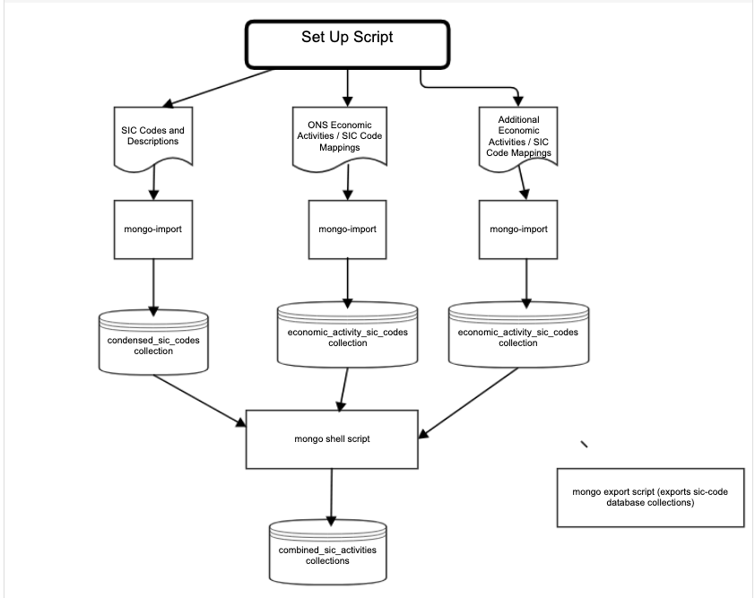

# Initial load of data into the Mongo database

## Summary

For the initial release a set of Mongo DB import files will be created for each Mongo Collection and stored in the GitHub repository. These will then be imported in each target environment via a manually triggered concourse job.

The following collections will be sourced from `csv` files (in the `initial_data_load/datafiles` directory):

- `condensed_sic_codes`. This `csv` file is available from Standard industrial classification of economic activities (SIC). This contains 731 SIC codes.
- `ons_economic_activity_sic_codes`. This list was last updated in 2007 and the `csv` file contains 15955 SIC related economic activities. This spreadsheet is available from Indexes with addendum (November 2020)
- `ch_economic_activity_sic_codes`. This is a new list supplied by Companies House business teams who create this from user queries where Companies House staff have to find the appropriate economic activity for an activity that was not on the 2007 ONS list (e.g. Amazon Seller, YouTuber).

The collection, `combined_sic_activities`, has been created by merging the above collections via a mongo script. This collection is used for the Mongo search (using the activity_description_search_field for a text search lookup).

## Diagram



## Import the standard `sic-code` import files

Run

``` bash
initial_data_load/scripts/import-mongo-collections.sh
```

## Creating the initial set of Mongo DB import files on your mac

You need to have both `mongo` and `mongoexport`. These can be installed via Homebrew either by installing the Mongo Database or the [MongoDB Database Tools](https://docs.mongodb.com/database-tools/installation/installation-macos/).

Make sure that you have the SIC_CODE_API_MONGO_URL and SIC_CODE_API_DATABASE variables setup as described in the [Project Readme](./README.md)

Run:

- initial_data_load/scripts/initialise-mongo-db.sh. This creates (or recreates) the SIC Code database (using $SIC_CODE_API_DATABASE) using the Mongo DB location $SIC_CODE_API_MONGO_URL
- initial_data_load/scripts/export-mongo-collections.sh. This exports the above files into the `initial_data_load/import_files` directory (for future use with concourse).
