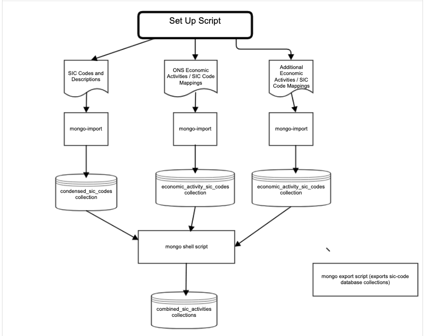

# Initial load of data into the Mongo database

## Summary

For the initial release a set of Mongo DB import files will be created for each Mongo Collection and stored in the GitHub repository. These will then be imported in each target environment via a manually triggered concourse job.

The following collections will be sourced from `csv` files (in the `initial_data_load/datafiles` directory):

The collection, `combined_sic_activities`, has been created by merging the above collections via a mongo script (it also removes any bracket characters that caused misses in the search match). This collection is used for the full-text Mongo search as describe in [Full text search](full-text-search.md).

## Diagram



## Import the standard `sic-code` import files

Run

``` bash
initial_data_load/scripts/import-mongo-collections.sh
```

## Creating the initial set of Mongo DB import files on your mac

You need to have both `mongo` and `mongoexport`. These can be installed via Homebrew either by installing the Mongo Database or the [MongoDB Database Tools](https://docs.mongodb.com/database-tools/installation/installation-macos/).

Make sure that you have the SIC_CODE_API_MONGO_URL and SIC_CODE_API_DATABASE variables setup as described in the [Project Readme](./README.md)

Run:

- initial_data_load/scripts/initialise-mongo-db.sh. This creates (or recreates) the SIC Code database (using $SIC_CODE_API_DATABASE) using the Mongo DB location $SIC_CODE_API_MONGO_URL
- initial_data_load/scripts/export-mongo-collections.sh. This exports the above files into the `initial_data_load/import_files` directory (for future use with concourse).
