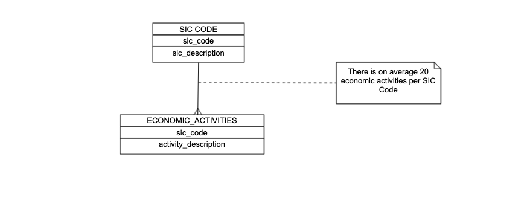

# The Sic Code database

All diagrams in this page are copies from [Sic Code HLD Confluence page](https://companieshouse.atlassian.net/wiki/spaces/TS/pages/3679551572/SIC+Code+Tool+HLD)

## Summary

The `sic-code` database is a MongoDB database created by the [Github `sic-code-data` repository](https://github.com/companieshouse/sic-code-data).

## Data Model

The data model is quite simple with:

- "SIC Code" being implemented in the `condensed_sic_codes` collection.
- "Economic Activities" being implemented in the `ons_economic_activity_sic_codes` and `ch_economic_activity_sic_codes` collections

The [Github `sic-code-data` repository](https://github.com/companieshouse/sic-code-data) produces the `combined_sic_activities` collection which is used in the application text search.

## Mongo Collections index

- `combined_sic_activities`. This has a Text index based on the following fields:
  - `sic_code`,
  - `sic_description`,
  - `activity_description`.
