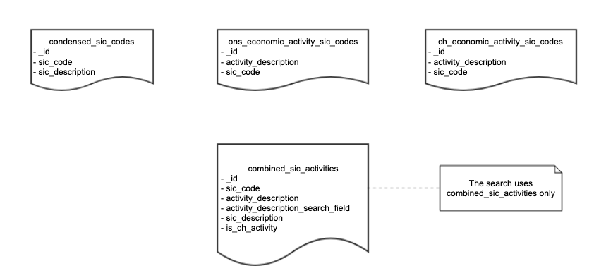

# The Sic Code database

All diagrams in this page are copies from [Sic Code HLD Confluence page](https://companieshouse.atlassian.net/wiki/spaces/TS/pages/3679551572/SIC+Code+Tool+HLD)

## Summary

The `sic-code` database is a MongoDB database with the following collections:

- `condensed_sic_codes`. This is a list of SIC Codes and their descriptions. These were introduced in 1948 to classify companies depending on the economic activity they conducted. Companies can select up to four SIC Codes. This list was last updated in 2007. The data for this list is sourced from [UK Government Condensed SIC list in CSV format](https://assets.publishing.service.gov.uk/government/uploads/system/uploads/attachment_data/file/527619/SIC07_CH_condensed_list_en.csv)
- `ons_economic_activity_sic_codes`. This is the main list of Economic activities and is only occassionally updated outside of SIC code revisions (typically for high profile events such as new economic activities related to COVID-19). This is sourced from the the [ONS Spreadsheet](https://www.ons.gov.uk/file?uri=/methodology/classificationsandstandards/ukstandardindustrialclassificationofeconomicactivities/uksic2007/uksic2007indexeswithaddendumnovember2020.xlsx)
- `ch_economic_activity_sic_codes`. This is a supplementary list of Economic activies and is maintained by Companies House business teams who create this from user queries where Companies House staff have to find the appropriate economic activity for an activity that was not on the above ONS list (e.g. Amazon Seller, YouTuber). This list will change more often than the ONS list but purely as a result of user queries about SIC Codes (but at a maxium of one update a month).
- `combined_sic_activities`. This collection is built from the data in the other collections and is the only collection used in the application.

## Data Model

The data model is quite simple with:

- "SIC Code" being implemented in the `condensed_sic_codes` collection.
- "Economic Activites" being implemented in the `ons_economic_activity_sic_codes` and `ch_economic_activity_sic_codes` collections

To simplify and speed up the application, the above collections are merged into the `combined_sic_activities` collection (which is used in the application text search)

## Mongo Collections

## Mongo Collections indexes

- `condensed_sic_codes`. The `sic_code` field has a unique index,
- `combined_sic_activities`. This has a Text index based on the following fields:
  - `sic_code`,
  - `sic_description`,
  - `activity_description`.
